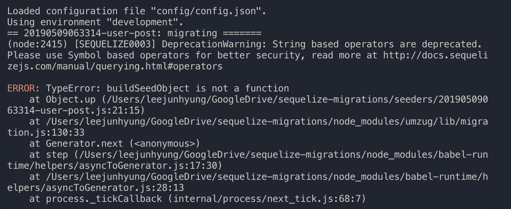

# Sequelize Migrations

## What is migration

Migration in database means either

- change the structure of the table
- add/delete new data into database

With `sequelize-cli`, you can do first thing with `db:migrate` and second thing with `db:seed`.

## How to do migration

Migration is similar to version control system.
So you save current state in migration files and each of them can be migrated or rolled back.

In sequelize migration file, those operations are expressed as `up` and `down`.

```js
module.exports = {
  /*
   * This operation describes how `queryInterface` can build table named `User`.
   */
  up: (queryInterface, Sequelize) => {
    return queryInterface.createTable('User', {
      id: {
        allowNull: false,
        autoIncrement: true,
        primaryKey: true,
        type: Sequelize.INTEGER
      },
      username: {
        type: Sequelize.STRING,
        allowNull: false,
      },
      createdAt: {
        allowNull: false,
        type: Sequelize.DATE
      },
      updatedAt: {
        allowNull: false,
        type: Sequelize.DATE
      }
    });
  },
  /*
   * This operation describes how `queryInterface` can remove table named `User`.
   */
  down: (queryInterface, Sequelize) => {
    return queryInterface.dropTable('User');
  }
};
```

Then how can we go back to previous states?
Like we do `git reset HEAD~1`, we undo our migrations.

So,

```shell
npx sequelize db:migrate:undo
```

This will bring you to the previous state, so that you can make changes.

And as you can imagine, we can do `npx sequelize db:migrate` again to apply newly made changes.

## Bugs

- `dbName`.`tableName` not found.

You have to match first argument in `createTable` with the name in your `model` file.

So,

```js
// migration file
module.exports = {
  up: (queryInterface, Sequelize) => {
    return queryInterface.createTable('User', {
  ...

// model file
module.exports = (sequelize, DataTypes) => {
  const User = sequelize.define('User', {
    username: {
      type: DataTypes.STRING,
      allowNull: false,
    },
    email: {
      type: DataTypes.STRING,
      allowNull: false,
    },
    password: {
      type: DataTypes.STRING,
      allowNull: false,
    },
  }, { tableName: 'User' }); // tableName must be overridden
```

- Invalid `scopeName` called.

Scope used association before it's setup and ready.

checkout [using scopes](###using-scopes)

## Tips

### use `debug` flag always

It provides useful stack trace of a failed operation.



### how to use `enum` in cli

```shell
npx sequelize model:generate --name User --attributes 'state:enum:{active,inactive}'
```

### use association inside `seed` file

Sadly, you can't use association with `queryInterface.bulkInsert`.
If you want to use association with create, then use `models` with `include`.

if you need code sample for 1:n relationship, then checkout `seeders/20190509063314-user-post.js`.
or if you're looking for n:m relationship, then checkout `seeders/20190510022705-post-tag.js`.

### using scopes

`scope` is useful when you have complex query options that can be reused throughout your application.

However, if you want to use association inside scope, then you should make sure all your models/association are setup and ready.

So,

```js
Object.keys(db).forEach(modelName => {
  if (db[modelName].associate) {
    db[modelName].associate(db);
  }
});

Object.keys(db).forEach(modelName => {
  if (db[modelName].loadScopes) {
    db[modelName].loadScopes(db);
  }
});
```

Now you can ensure that associations are setup before `loadScope` call.